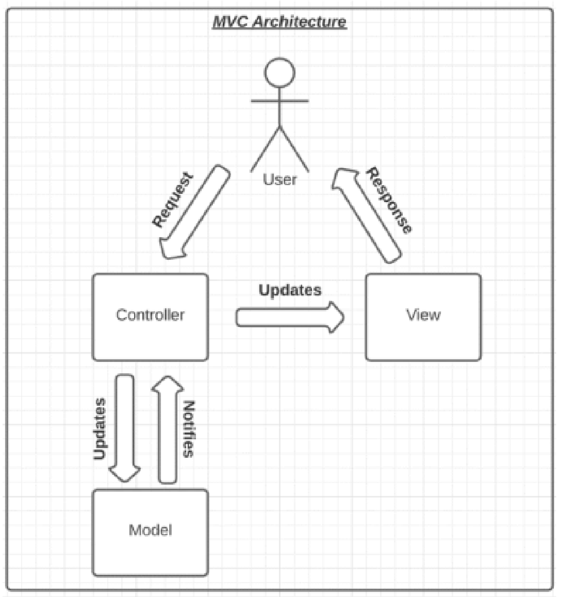
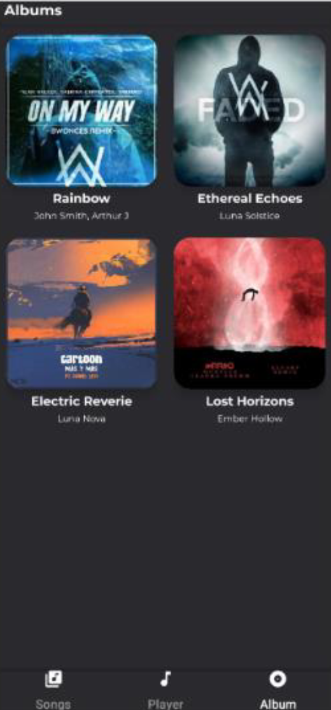
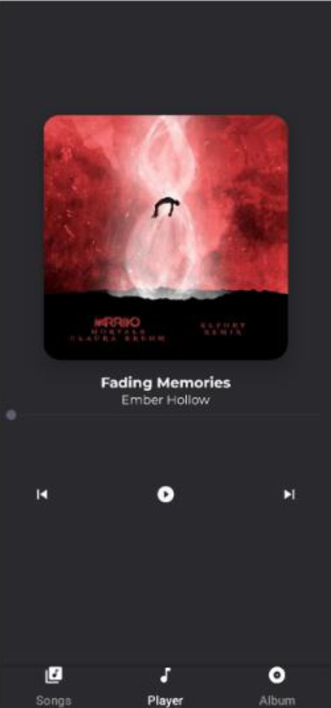
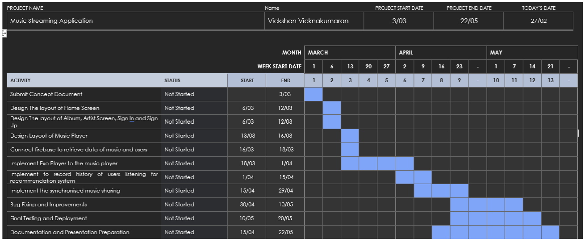

# 🎵 Music Streaming Android Application

An Android music streaming application developed as part of the CI660 - Advanced Mobile Application Development module. The app allows users to browse and play songs and albums with a seamless and responsive user interface using Firebase Realtime Database.

## 📱 Features

- 🔥 Advanced UI with Material Design  
- 🎶 Browse and filter songs  
- 📂 View albums and their tracks  
- ▶️ Music playback with play/pause, next/previous, and seek bar  
- ☁️ Firebase Realtime Database integration  
- 🔄 Seamless navigation using ViewPager2 and Fragments  
- 📸 Glide and Picasso for image handling  

---

## 🧠 Architecture

The app follows the **MVC (Model-View-Controller)** architectural pattern:

- **Model**: Handles data fetching from Firebase  
- **View**: Includes all fragments displaying UI (SongListFragment, AlbumListFragment, etc.)  
- **Controller**: Controls navigation, playback logic, and fragment communication  

  

---

## 📂 Screenshots

<table>
  <tr>
    <td align="center"><b>Home</b></td>
    <td align="center"><b>Album List</b></td>
    <td align="center"><b>Music Player</b></td>
  </tr>
  <tr>
    <td></td>
    <td></td>
    <td></td>
  </tr>
</table>

---

## 🧪 Testing

Performed both **functional** and **device testing** including:
- Bundle passing and validation
- Array operations and error handling
- Device testing on Android emulator and physical devices
- Layout bound and refresh rate analysis

---

## 🛠 Tools & Technologies

- Java  
- Firebase Realtime Database  
- Android Studio  
- Glide & Picasso  
- ViewPager2 & FragmentStateAdapter  
- MediaPlayer API  

---

## 🧭 Navigation

Implemented using `ViewPager2` and `TabLayoutMediator` for fragment switching:

- Songs List  
- Music Player  
- Albums List  
- Album View  

---

## 🗺️ Future Improvements

- 🔍 ML-based song recommendations  
- 🎤 Lyrics integration  
- 📅 Artist tour/concert data  
- 🎧 Enhanced custom API integration  

---

## 📅 Project Management

- Agile methodology  
- Feature-focused development  
- Frequent backups using version control  
- Iterative testing and feedback  

  

---

## 📚 References

- [Firebase](https://firebase.google.com/)  
- [Glide](https://github.com/bumptech/glide)  
- [Picasso](https://square.github.io/picasso/)  
- [Material Design 3](https://m3.material.io/)  

---

## 👨‍💻 Developed by

**Vickshan Vicknakumaran**  
University of Brighton

---
