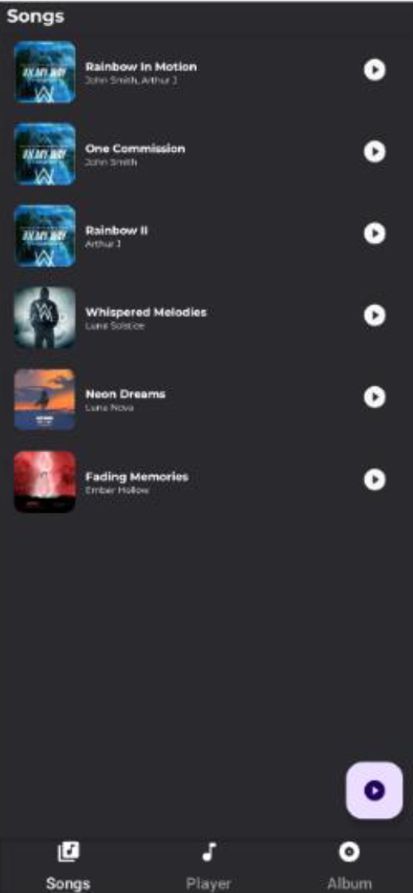

# 🎵 Music Streaming Android Application

An Android music streaming application developed as part of the CI660 - Advanced Mobile Application Development module. The app allows users to browse and play songs and albums with a seamless and responsive user interface using Firebase Realtime Database.

## 📱 Features

- 🔥 Advanced UI with Material Design
- 🎶 Browse and filter songs
- 📂 View albums and their tracks
- ▶️ Music playback with play/pause, next/previous, and seek bar
- ☁️ Firebase Realtime Database integration
- 🔄 Seamless navigation using ViewPager2 and Fragments
- 📸 Glide and Picasso for image handling

---

## 🧠 Architecture

The app follows the **MVC (Model-View-Controller)** architectural pattern:

- **Model**: Handles data fetching from Firebase
- **View**: Includes all fragments displaying UI (SongListFragment, AlbumListFragment, etc.)
- **Controller**: Controls navigation, playback logic, and fragment communication

---

## 📂 Screenshots

| Home | Album List | Music Player |
|------|------------|--------------|
|  |  |  |

> Replace these with actual images from your app under a `screenshots/` folder in your repository.

---

## 🧪 Testing

Performed both **functional** and **device testing** including:
- Bundle passing and validation
- Array operations and error handling
- Device testing on Android emulator and physical devices
- Layout bound and refresh rate analysis

---

## 🛠 Tools & Technologies

- Java
- Firebase Realtime Database
- Android Studio
- Glide & Picasso
- ViewPager2 & FragmentStateAdapter
- MediaPlayer API

---

## 🧭 Navigation

Implemented using `ViewPager2` and `TabLayoutMediator` for fragment switching:

- Songs List
- Music Player
- Albums List
- Album View

---

## 🗺️ Future Improvements

- 🔍 ML-based song recommendations
- 🎤 Lyrics integration
- 📅 Artist tour/concert data
- 🎧 Enhanced custom API integration

---

## 📅 Project Management

- Agile methodology
- Feature-focused development
- Frequent backups using version control
- Iterative testing and feedback

---

## 📚 References

- [Firebase](https://firebase.google.com/)
- [Glide](https://github.com/bumptech/glide)
- [Picasso](https://square.github.io/picasso/)
- [Material Design 3](https://m3.material.io/)

---

## 👨‍💻 Developed by

**Vickshan Vicknakumaran**  
University of Brighton

---
